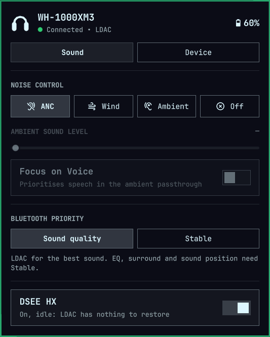
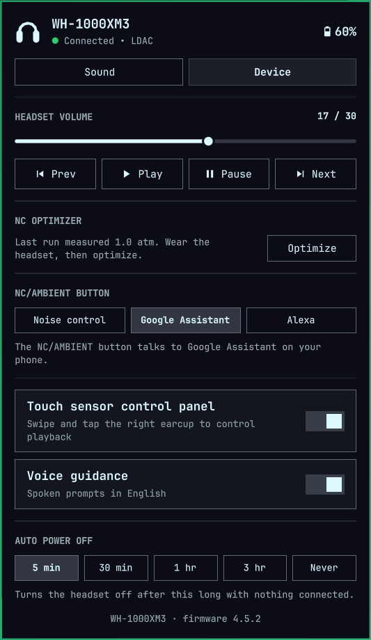
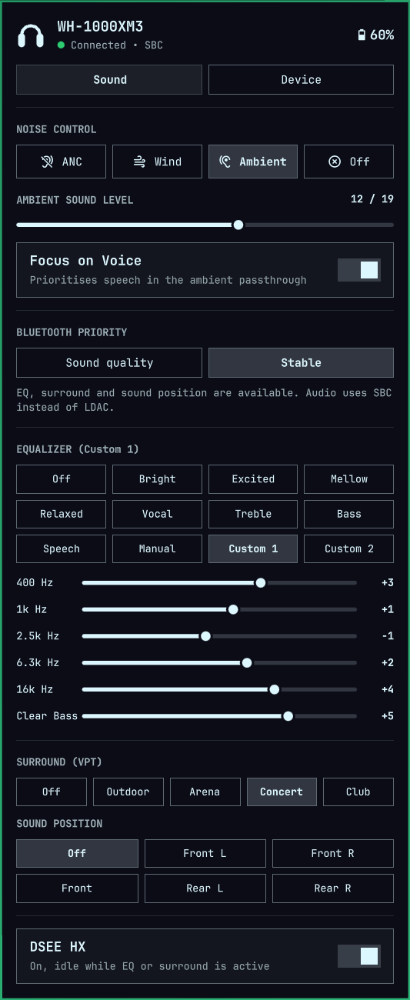

# Omarchy Sony XM3

An Omarchy bar-widget plugin and headless C++20 daemon for managing **Sony
WH-1000XM3** headphones on Linux.

This is a port of [andROYdified/omarchy-sony](https://github.com/andROYdified/omarchy-sony)
(WH-1000XM5) to the XM3's older Bluetooth command set. The architecture is the
same; the protocol layer and the feature set are not — see
[Why this is a port, not a config change](#why-this-is-a-port-not-a-config-change).

<p align="center">
  
</p>

<table>
  <tr>
    <th>Sound</th>
    <th>Device</th>
  </tr>
  <tr>
    <td valign="top"></td>
    <td valign="top"></td>
  </tr>
</table>

---

## Requirements

**The headphones must be paired to this machine's own Bluetooth adapter.**

Control runs over an RFCOMM socket that BlueZ opens to the headset. A USB
Bluetooth *audio transmitter* dongle (Avantree DG60, TaoTronics, and similar)
pairs with the headphones itself and shows up on Linux as a USB sound card — the
host Bluetooth stack never sees the headphones, so there is nothing for the
daemon to connect to. The XM3 also holds only one host link at a time, so it
cannot be on such a dongle and on this machine simultaneously.

If audio currently reaches your headphones through a transmitter dongle, you
will need to pair them directly to this machine to use any of this. `./setup`
checks for an adapter and a paired headset and warns you if either is missing.

---

## Features

- 🔋 **Live battery & codec** — percentage, charging state, and the negotiated codec (LDAC, aptX HD, aptX, AAC, SBC).
- 🎧 **Noise control** — Noise Cancelling, Wind Noise Reduction, Ambient Sound, and Off.
- 🔊 **Ambient sound slider** — the XM3's full passthrough range, with Focus on Voice.
- 🎛️ **Equalizer** — all twelve presets, with band sliders (400 Hz–16 kHz + Clear Bass) for Manual, Custom 1 and Custom 2.
- 📶 **Bluetooth priority** — LDAC ("sound quality") or stable connection, switchable from the panel.
- 🎚️ **DSEE HX** — the XM3's upscaling, with an honest "on but idle" state (it switches itself off on LDAC).
- 🎪 **Surround (VPT)** — Outdoor Festival, Arena, Concert Hall, Club.
- 🧭 **Sound position** — front, front L/R, rear L/R.
- 🎯 **NC Optimizer** — tunes noise cancelling to your fit and the air pressure, with live progress.
- 🔈 **Headset volume and playback** — the headset's own volume, plus play, pause and skip.
- 🔘 **NC/AMBIENT button** — make the left-earcup button switch noise control, or talk to Google Assistant or Alexa.
- 👆 **Touch sensor control panel** — turn the right-earcup swipe controls on or off.
- 🗣️ **Voice guidance** — spoken prompts on or off.
- ℹ️ **Firmware version**, read from the headset.
- ⏻ **Auto power off** — 5 / 30 / 60 / 180 min, or disabled.
- 🗂️ **Two tabs** — *Sound* and *Device*, so the panel stays short.
- ⌨️ **Keyboard navigation** — vim-style (`h`/`j`/`k`/`l`, `Enter`, `Esc`) in the panel.
- 💻 **CLI (`sony-xm3-ctl`)** — everything the panel does, scriptable.
- ⚡ **No polling** — native BlueZ RFCOMM, and the daemon pushes each state change to the panel over its socket.

---

## Noise control is one slider, not three buttons

Worth understanding before you use it, because it is the XM3's actual hardware
model rather than a UI choice:

| Step | Mode |
|---|---|
| 0 | Noise Cancelling |
| 1 | Wind Noise Reduction |
| 2 … 19 | Ambient Sound, increasing passthrough |

The mode *is* the step. `sony-xm3-ctl ambient-level 0` and
`sony-xm3-ctl noise anc` are the same command; setting an ambient level of 12
puts the headset in ambient mode at step 12. The panel presents mode buttons and
a slider over the ambient part of the range, and the daemon remembers where you
left the slider so switching ANC → Ambient returns there.

The upper bound comes from the headset itself (`NCASM_RET_CAPABILITY`), falling
back to 19 until it answers.

---

## Architecture

```
┌────────────────────────────────────────────────────────┐
│                   Omarchy Shell (QML)                  │
│   ┌───────────────┐ ┌─────────────┐ ┌──────────────┐   │
│   │   SonyIcon    │ │  Service    │ │    Panel     │   │
│   └───────▲───────┘ └──────▲──────┘ └──────▲───────┘   │
│           │                │               │           │
│           └────────────────┼───────────────┘           │
│                            │ one UNIX socket:          │
│                            │ commands out,             │
│                            │ state pushed back         │
└────────────────────────────┼───────────────────────────┘
                             │
┌────────────────────────────┼───────────────────────────┐
│  Headless Daemon           │      Companion CLI        │
│  (sony-xm3-daemon)         │      (sony-xm3-ctl)       │
│                            │            │              │
│   UNIX Domain Socket ◄─────┴────────────┘              │
│   (/run/user/$UID/sony-xm3.sock)                       │
│                 │                                      │
│                 │  also writes ~/.local/state/         │
│                 │  sony-xm3/status.json (0600) for     │
│                 │  scripts that want to read it        │
│                 ▼                                      │
│   Bluetooth RFCOMM  (MDR v1 / table 1 protocol)        │
│                 │  (channel resolved over SDP)         │
│                 ▼                                      │
│       Sony WH-1000XM3                                  │
└────────────────────────────────────────────────────────┘
```

The widget lives inside the long-lived shell process, so it keeps that side as
narrow as it can: it starts no processes, resolves nothing through `PATH` and
opens no files. It connects to the daemon's socket in this login session's
runtime directory (`/run/user/<uid>`), refusing any other path, sends
`subscribe`, and is then pushed every state change.

The socket itself belongs to your systemd user manager, not to the daemon:
`sony-xm3.socket` creates it at login and holds it until logout, and the daemon
inherits the listening descriptor instead of binding the path. The name is
therefore never unbound while you are logged in, including while the daemon
restarts, so nothing can take it and answer in the daemon's place — and a
connection that arrives while the daemon is stopped starts it.

Whatever is on the other end is still treated as untrusted. The parser hands
the plugin raw chunks and each one is counted against a 64 KiB budget before it
is buffered or searched for a newline, so a peer that never sends one cannot
grow the shell's memory. At most 32 commands may be in flight, each is length
checked, and a daemon that does not answer within five seconds is dropped and
retried with a backoff.

- **Plugin** (`Panel.qml`, `Service.qml`, `Model.js`, `SonyIcon.qml`) — Quickshell/QML, Omarchy manifest schema 1.
- **`daemon/`** — C++20 daemon owning the RFCOMM link and the UNIX socket.
- **`cli/`** — `sony-xm3-ctl`, a thin client for the same socket.
- **`installer/`** — `sony-xm3-deploy`, the helper `setup` uses to place and remove files without following symlinks (built, never installed).
- **`daemon/sony-xm3.socket`** — the systemd user socket that owns the control socket for the session; `daemon/sony-xm3.service` pulls it in.

---

## Prerequisites

Arch / Omarchy:
```bash
sudo pacman -S --needed base-devel cmake ninja bluez bluez-libs bluez-utils dbus jq
```

Debian / Ubuntu:
```bash
sudo apt update && sudo apt install -y build-essential cmake ninja-build libbluetooth-dev libdbus-1-dev jq
```

---

## Install

```bash
git clone https://github.com/kevincardwell/omarchy-sony-xm3.git
cd omarchy-sony-xm3
./setup
```

`./setup` verifies build dependencies, warns about missing Bluetooth
prerequisites, builds with CMake + Ninja, installs `sony-xm3-daemon` and
`sony-xm3-ctl` to `~/.local/bin/`, registers the `sony-xm3.service` user unit,
and deploys the plugin to `~/.config/omarchy/plugins/`.

**How setup protects itself.** Setup re-runs itself with an empty environment
and a fixed system `PATH` (`/usr/bin:/usr/sbin:/bin:/sbin`). It keeps only the
session variables that `systemctl --user` and the Omarchy shell need, and runs
bash with `-p`, so `BASH_ENV` and exported shell functions are ignored. Every
tool it runs (`sudo`, `pacman`, `omarchy`, `cmake`, `ninja`, the compiler,
`systemctl`) is called by an absolute path and must be a root-owned file that
only root can write. It builds in its own `build-setup/` directory with the
compiler and generator pinned. Every file in your home directory is written or
removed by `sony-xm3-deploy`. It opens each directory below your home with
`O_NOFOLLOW`, keeps it open while it works, and refuses symlinks and
directories other users own or can write to. It writes each file to a
temporary name and renames it into place. It deletes only the files it is
named, never a directory tree.

**Installed from the Omarchy plugin marketplace** (or with `omarchy plugin
add`)? That adds the bar widget only. The widget needs the daemon, so build and
install it from the plugin's own directory:

```bash
~/.config/omarchy/plugins/io.github.kevincardwell.omasonyxm3/setup
```

Setup notices it is running from the installed plugin and uses those files in
place.

Pair the headset first if you have not already:

```bash
bluetoothctl
  scan on
  pair    <MAC>
  trust   <MAC>
  connect <MAC>
```

---

## Uninstall

```bash
./setup --uninstall
```

This stops and removes `sony-xm3.service`, deletes the two binaries from
`~/.local/bin/` and the state in `~/.local/state/sony-xm3/`, and runs
`omarchy plugin remove`, which takes the widget off the bar and deletes the
plugin directory. Your Bluetooth pairing is left alone. If you installed from
the marketplace, run it as
`~/.config/omarchy/plugins/io.github.kevincardwell.omasonyxm3/setup --uninstall`.

---

## CLI

```bash
sony-xm3-ctl status                    # full state as JSON

# Noise control
sony-xm3-ctl noise anc                 # step 0
sony-xm3-ctl noise wind                # step 1
sony-xm3-ctl noise ambient             # last ambient step
sony-xm3-ctl noise ambient 12          # a specific ambient step
sony-xm3-ctl noise off                 # noise processing off
sony-xm3-ctl ambient-level 12          # same axis, directly
sony-xm3-ctl voice-focus on            # Focus on Voice (step 2+)

# Equalizer (needs Stable priority; LDAC blocks it)
sony-xm3-ctl eq vocal
sony-xm3-ctl eq user1                  # select Custom 1 (custom = Manual, user2 = Custom 2)
sony-xm3-ctl eq custom 0 2 4 2 0 5     # set Manual's 5 bands then Clear Bass, each -10..10

# Everything else
sony-xm3-ctl dsee on                   # DSEE HX
sony-xm3-ctl surround concert          # off|outdoor|arena|concert|club
sony-xm3-ctl sound-position front      # off|front-left|front-right|front|rear-left|rear-right
sony-xm3-ctl auto-power-off 180min     # off|5min|30min|60min|180min
sony-xm3-ctl connection quality        # quality|stable

# Device
sony-xm3-ctl optimizer start           # NC Optimizer: wear the headset, it plays test tones
sony-xm3-ctl volume 15                 # headset volume, 0..30
sony-xm3-ctl playback pause            # play|pause|next|previous
sony-xm3-ctl nc-button ambient         # ambient|google-assistant|alexa
sony-xm3-ctl touch-panel on
sony-xm3-ctl voice-guidance off

# Protocol exploration: the reply appears in the daemon's journal
sony-xm3-ctl raw 04 02                 # table-1 payload (this one asks for the firmware version)
sony-xm3-ctl raw2 46 01 01             # table-2 payload
```

Exit codes: `0` success, `1` bad arguments or a daemon error, `2` daemon
unreachable.

---

## Service

```bash
systemctl --user status sony-xm3.service
journalctl --user -u sony-xm3.service -f
systemctl --user restart sony-xm3.service
```

The daemon also runs offline for development:

```bash
sony-xm3-daemon --mock --state-dir /tmp/xm3 --runtime-dir /run/user/$UID
```

---

## Tests

```bash
# C++ protocol, state and IPC unit tests
cmake -B build -G Ninja && cmake --build build
./build/daemon/test_protocol

# C++ stress and boundary suites
./build/tests/stress_test_protocol
./build/tests/stress_test_boundary_transport

# Installer helper: refuses symlinks, deletes only named files
./tests/test_deploy.sh build/installer/sony-xm3-deploy

# All of the above that CMake knows about
ctest --test-dir build

# Plugin model tests (Deno or Node)
deno run --allow-read tests/model.test.js

# End-to-end simulation
./tests/integration.sh

# Python stress suites
python3 tests/stress_ipc.py
python3 tests/stress_daemon_lifecycle.py
python3 tests/challenger_stress.py
```

---

## LDAC or EQ: the XM3 makes you choose

The headset has two Bluetooth priorities, and they are a real trade-off, not a
preference:

| | Sound quality (LDAC) | Stable connection |
|---|---|---|
| Codec | LDAC, up to 990 kbps | SBC |
| Headset EQ, surround, sound position | **unavailable** | available |
| DSEE HX | idle (nothing to restore) | active |

On "sound quality" the XM3 does not apply EQ or surround at all — sent anyway,
it answers with a prompt to change connection mode instead. The panel hides
those sections and says why; the CLI refuses them with the same explanation.
Switch to "stable" and they appear:

<p align="center">
  
</p>

**For the best sound, stay on "sound quality"** and, if you want EQ, do it on the
PC with [EasyEffects](https://github.com/wwmm/easyeffects) — that applies before
the audio is encoded, so you keep LDAC.

### LDAC bitrate: leave it adaptive

PipeWire runs LDAC adaptively by default: up to 990 kbps, stepping down to 660 or
330 kbps when the link is marginal. You can pin it at 990 kbps — but on the
machine this was developed on, that produced occasional glitches where adaptive
simply dropped a step for a moment. Adaptive is the better default. If you want
to try pinning it anyway, drop this in `~/.config/wireplumber/wireplumber.conf.d/`:

```
monitor.bluez.rules = [
  {
    matches = [ { device.name = "bluez_card.XX_XX_XX_XX_XX_XX" } ]
    actions = { update-props = { bluez5.a2dp.ldac.quality = "hq" } }
  }
]
```

Use your headset's address, then `systemctl --user restart wireplumber`.

### If you hear faint periodic glitches

Combo WiFi/Bluetooth cards (the Intel AX210 and friends) share one 2.4 GHz
radio. A WiFi interface that is enabled but not connected makes NetworkManager
scan for networks every few minutes, and every scan briefly takes the radio away
from your audio. If you are on ethernet, `nmcli radio wifi off` fixes it.

---

## Not included, and why

Three things Sony's app does that this deliberately doesn't:

- **Adaptive Sound Control.** On the XM3 this is a *phone* feature: the app reads
  the phone's motion sensors to decide whether you are sitting, walking or on a
  train, then sends ordinary noise-control commands. The headset side is only a
  flag. On a stationary desktop there is nothing to detect.
- **Voice guidance language.** Switching language downloads a voice pack and
  streams it into the headset — the same kind of transfer as a firmware update.
  On/off is supported; the language is shown but not changed here.
- **Firmware updates.** A failed transfer can leave the headset unusable, and
  the update protocol is undocumented. Use Sony's phone app. (The WH-1000XM3's
  last firmware is 4.5.2, from May 2020 — the panel shows your version.)

---

## Why this is a port, not a config change

The XM3 speaks Sony's **v1** MDR command table; the XM5 speaks **v2**. Same
framing, same checksum, different command bytes for the same features — and a v2
command sent to an XM3 is accepted and silently ignored, so the failure mode is
"nothing happens" rather than an error. The differences that matter:

| | v1 (XM3) | v2 (XM5) |
|---|---|---|
| Battery | `0x10/0x11/0x13` | `0x22/0x23/0x25` |
| NC/ASM | type `0x02`, 8-byte payload, one step axis | type `0x17`, 7-byte payload, discrete modes |
| EQ inquired type | `0x01` | `0x00` |
| Upscaling inquired type | `0x02` (DSEE HX) | `0x01` (DSEE Extreme) |
| Wearing detection | not on the XM3 (no sensor) | type `0x01`, ON = `0x00` |
| Speak-to-Chat | — | supported |
| Multipoint | — | supported |
| Surround / sound position | supported (not while on LDAC) | — |
| Session handshake | required before any settings query | — |
| Service UUID | `96CC203E-…` | `956C7B26-…` |

Speak-to-Chat, Multipoint and wearing detection are gone from this build
because the XM3 has none of them; Surround, Sound Position, Auto Power Off and the LDAC link preference
are new because it does have those.

Full byte-level detail: [docs/protocol-v1.md](docs/protocol-v1.md).

---

## Acknowledgments

1. **[andROYdified/omarchy-sony](https://github.com/andROYdified/omarchy-sony)** — the XM5 project this is ported from: architecture, daemon/state/IPC design, and the QML panel.
2. **[thisisgm/omarchy-pods](https://github.com/thisisgm/omarchy-pods)** — the bar-widget + headless-daemon + atomic-state-file pattern underneath both.
3. **[Plutoberth/SonyHeadphonesClient](https://github.com/Plutoberth/SonyHeadphonesClient)** — the original XM3 client; the source for the v1 NC/ASM command shape.
4. **[mos9527/SonyHeadphonesClient](https://github.com/mos9527/SonyHeadphonesClient)** — its successor, whose generated `ProtocolV1T1.hpp` tables pinned down the rest of the v1 command set.

---

## Disclaimer

Unofficial community project for Linux desktop integration. Not affiliated with,
authorized, maintained, sponsored, or endorsed by Sony Corporation. "Sony" and
"WH-1000XM3" are trademarks of Sony Corporation.

---

## License

MIT. See [LICENSE](LICENSE).
